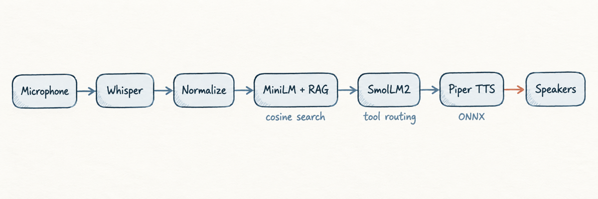

# voxlocal

**A fully local, low-latency voice agent for macOS.**

voxlocal runs the complete voice pipeline on-device: microphone input, Whisper
speech recognition, text normalization, MiniLM retrieval, SmolLM2 tool routing,
Piper speech synthesis, and speaker playback. Inference requires no API keys,
cloud services, or network access.



## Contents

- [Quick start](#quick-start)
- [Usage](#usage)
- [Testing](#testing)
- [Architecture and layout](#architecture-and-layout)
- [Models](#models)
- [Performance](#performance)
- [Build requirements](#build-requirements)
- [Version decisions](#version-decisions)
- [Known limitations](#known-limitations)

## Quick start

Install Rust and CMake, then download the models and build the release binary:

```bash
./setup.sh
./run.sh
```

`run.sh` is the intended entry point. It checks models and audio devices, finds
the binary in the configured Cargo target directory, handles Ctrl-C cleanly,
and falls back to `--selftest` when no usable microphone is available.

The default model directory is `.models/`. Override it with:

```bash
VOXLOCAL_MODELS=/path/to/models ./run.sh --selftest
```

> **Build note:** Cargo output is intentionally stored in `/tmp/vx`; the binary
> is not placed under `./target/release/`. See [Build requirements](#build-requirements).

## Usage

| Command | Purpose |
| --- | --- |
| `./run.sh` | Interactive five-second microphone loop. Requires a TTY. |
| `./run.sh --text "book a brake pad tomorrow"` | Run one text request without microphone input. |
| `./run.sh --wav /tmp/query.wav` | Run a complete pipeline from a WAV file. |
| `./run.sh --selftest` | Exercise the text pipeline with four built-in cases. |
| `./run.sh --wav-regression` | Run every `samples/*.wav` fixture end to end. |
| `./run.sh --probe-audio` | Record from the microphone and report peak/RMS levels. |
| `./run.sh --no-tts` | Skip Piper synthesis and speaker playback. |
| `./run.sh --check` | Run model and audio-device preflight only. |

For direct binary execution, resolve the release path from Cargo metadata:

```bash
BIN=$(cargo metadata --format-version 1 --no-deps | tr ',' '\n' \
      | grep '"target_directory"' | cut -d'"' -f4)/release/voxlocal
$BIN --selftest
```

Interactive mode requires a terminal because it prompts before each recording.
Use `--text`, `--wav`, or `--selftest` for scripts and redirected input.

## Testing

Run checks from least hardware-dependent to most interactive:

```bash
# Text pipeline: normalization → RAG → routing → executor
./run.sh --selftest

# Deterministic speech input; macOS example
say -v Samantha -o /tmp/query.wav --data-format=LEI16@16000 \
  "what is the price of an oil change"
./run.sh --wav /tmp/query.wav

# Microphone diagnostics
./run.sh --probe-audio

# Full interactive loop
./run.sh
```

The regression command runs all bundled WAV files without requiring a
microphone. Add another fixture by placing a `.wav` file in `samples/`.

```bash
./run.sh --wav-regression
```

Useful negative cases include `./run.sh --text "hi"`, which should reject
irrelevant retrieval context, and `./run.sh --wav bad.wav`, which exercises WAV
validation.

## Architecture and layout

Each stage reports timing so regressions can be located without guessing:

| Stage | Responsibility | Module |
| --- | --- | --- |
| 1 | Capture, downmix, and resample microphone audio | `src/capture.rs` |
| 2 | Whisper speech-to-text | `src/stt.rs` |
| 3 | Regex-based text normalization | `src/normalize.rs` |
| 4 | MiniLM embeddings and in-memory RAG | `src/rag.rs` |
| 5 | SmolLM2 tool routing and mock execution | `src/router.rs` |
| 6 | Piper text-to-speech | `src/tts.rs` |
| 7 | Audio playback through rodio | `src/playback.rs` |

`src/main.rs` loads models and selects modes. `src/pipeline.rs` handles WAV
decoding, turn orchestration, self-tests, and warm-up. `src/util.rs` contains
paths, timing, terminal detection, and latency-budget helpers.

## Models

`setup.sh` downloads these public Hugging Face artifacts into `.models/`:

| Role | Model | Approx. size |
| --- | --- | ---: |
| LLM | SmolLM2-135M-Instruct Q4_K_M GGUF + tokenizer | 114 MB |
| Embeddings | `sentence-transformers/all-MiniLM-L6-v2` | 97 MB |
| STT | Whisper `tiny.en` | 81 MB |
| TTS | Piper `en_US-lessac-medium` | 61 MB |

Model files are ignored by Git and are not required to run the text-only source
checks, but they are required for the full pipeline.

## Performance

Measured on an Apple M5 Pro using Metal for Whisper and Candle:

```text
capture     5099.2 ms   fixed five-second recording window
stt           60.9 ms
normalize      4.0 ms
rag           10.8 ms
llm           70.5 ms
tts           75.2 ms
play        1133.8 ms   audio duration, not compute latency
```

Typical compute time excluding capture and playback is approximately 175–235 ms.
The main cost is SmolLM2 decoding; playback and the deliberate recording window
are wall-clock durations rather than processing latency.

## Build requirements

- Rust 1.98 or newer
- CMake, required by vendored whisper.cpp and espeak-ng builds
- macOS audio permissions for microphone capture

### Why the target directory is short

`.cargo/config.toml` sets `target-dir = "/tmp/vx"`. The vendored espeak-ng build
uses a fixed path buffer and can truncate its phoneme-data path when the project
path is long. On macOS this can fail with:

```text
Failed to open: '.../phsource/vwl_en_us_nyc/a_rais'
```

Do not override the configured target directory unless the complete native build
path remains short. `/tmp` may be cleared after reboot, so a later build can be
required. A convenience symlink can restore the conventional binary path:

```bash
mkdir -p target/release
ln -sf /tmp/vx/release/voxlocal target/release/voxlocal
```

## Version decisions

- `cpal = 0.17` matches rodio 0.22 and avoids duplicate CoreAudio backends.
- Candle 0.11 matches the current MiniLM/BERT API used by the project.
- `tokenizers = 0.22` is selected explicitly because Candle does not provide it.
- Whisper is built with the `metal` feature for Apple Silicon acceleration.
- Whisper thread count is left at the library default; setting it to zero can
  abort the process.

## Known limitations

**Microphone permission:** The first interactive run may appear to hang while
macOS waits for microphone approval. Grant access under System Settings → Privacy
& Security → Microphone.

**Small routing model:** SmolLM2-135M does not always follow the closed tool
vocabulary or preserve arguments. The router therefore repairs truncated JSON,
snaps unknown tools to the allowed set, derives services from retrieved context,
and extracts time from the current query.

**Failed turns:** An unparseable model response costs one turn but does not end
the interactive session.

**TTS runtime:** `piper-rs` currently pins an ONNX Runtime release candidate.
Replacing it with sherpa-onnx is a possible future simplification.

**RAG scale:** Retrieval is exact cosine search over an in-memory corpus, capped
at two hits and filtered at `RAG_MIN_SIM = 0.35`. It is intended for a small
corpus, not thousands of documents.
